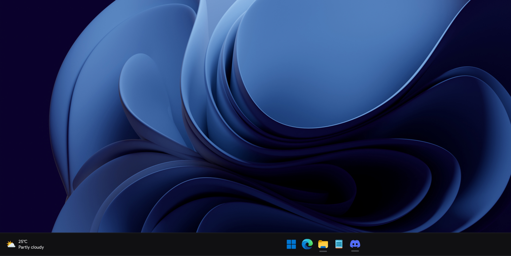
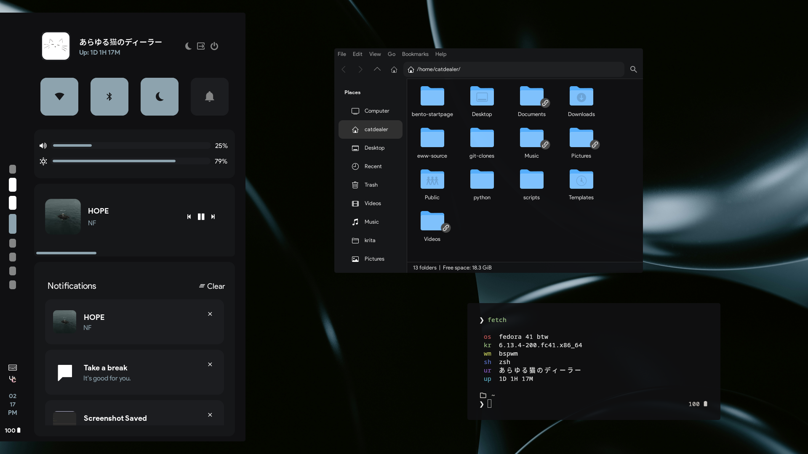

# Old eww projects

Uh I guess I should add some more screenshots at some point ....

Includes code for:
## Pindows 11

Windows 11 styled rice, taskbar icons were very slow to get, may recreate .....

## Modern-dark

A modern-styled rice, but slow and inconsistently themed.

## Wyvern

An abandoned idea that I might revisit ... made to be fast and work-flow centered, with minimal distractions.

## SSlim

A rice idea where there's hidden panels on each side of the screen.

## Radient

My light theme rice, similar to [fibreglass (old ver.)](https://github.com/dealerofallthecats/fibreglass/tree/old).

## Ascii

Ascii themed bar + notifs

## Other random junk ........
